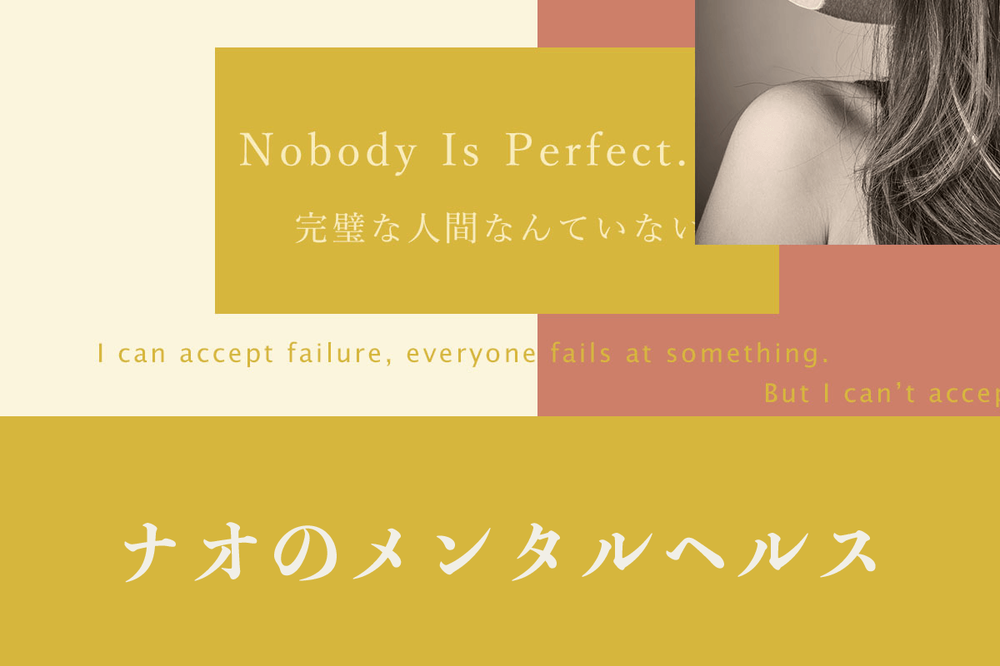

## どんなサイトなの？

心の健康をテーマに様々な情報を発信していくメンタルヘルス系のブログです。

難しいことを考えずに簡単に分かりやすく情報を提供できれば嬉しいので、読者が負担にならないように、各記事の内容は**５分以内**に読めるようにしています。

## せっかくなので私のことも力一杯自己紹介してみます！

私は、統合失調症を抱えながら生きていますが、なんとか生きている感じです。

性格は、優しくて、傷つきやすいそんな人間です。

趣味はプログラミング、苦手なものはデザイン。

好きな食べ物は納豆、卵、お寿司。

好きな飲み物はミルクです！

嫌いな食べ物は、甘いもの。でもミルクココアは別デス！

音楽が好きで雑食系、声フェチです！

愛する人は年上の彼氏さんです！

冬に弱く、夏に弱く、春と秋に生きるそんな人生を送っています。

好きな言葉は水谷修さんにサインして頂いた「冬来たりば春遠からじ」の名言です。

[Twitter](https://twitter.com/naominamecom)もやっています。

## ブログを始めたきっかけって？

彼氏さんがうつ病を再発してしまったことがきっかけで、

何か力になれることはないかと、情報収集するうちに、

得られた知識をアウトプットしたいと思いブログを作成しました。

ですので、最初はうつ病メインにしようかと思っていました。

しかし、せっかくブログを作るなら、

私自身も病気だったため、それについての当事者からの体験や知識なども含めて

アウトプットすれば色々な人が役に立てることもあるのではないかという思いで、

テーマが拡大した結果、今のようなブログとなりました。

## ブログ・・・のデザイン？

Simple is the best ですっ！ （というなの手抜きですっ）

製作者は予算を抑えるためにデザインコストにお金をかけてはいません笑

## ポッドキャストも実はしています。

実はナオのメンタルヘルスという、心の病気や健康に関してをテーマとしたポッドキャストもしています。

<iframe allow="autoplay *; encrypted-media *; fullscreen *; clipboard-write" width="100%" height="450" sandbox="allow-forms allow-popups allow-same-origin allow-scripts allow-storage-access-by-user-activation allow-top-navigation-by-user-activation" src="https://embed.podcasts.apple.com/jp/podcast/%E3%83%8A%E3%82%AA%E3%81%AE%E3%83%A1%E3%83%B3%E3%82%BF%E3%83%AB%E3%83%98%E3%83%AB%E3%82%B9%E3%83%A9%E3%82%B8%E3%82%AA/id1649348148"></iframe>
