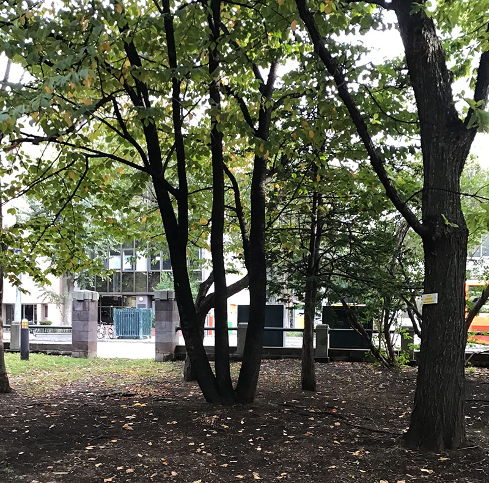

今回は私、ナオが健康のために気を配っていることについてお話ししていきたいと思います。

## 比較的難易度が低く効果が出やすい

今回ご紹介するのは、取り掛かるのが簡単で個人的に効果があったものを紹介していきます。
もしよければ試してみてくださいね。

### 自然の中を散歩してみる方法

家の近くに、公園があり、自然に囲まれていた場所を天気が良い時には散歩しています。

散歩は一回につき一時間ほど歩いています。

実は自然の中を歩くことにより、ストレスや不安、うつ病などの精神疾患の症状を和らげることも分かっています。

**特にうつ病には同じことを悲観的に考えてしまうところが、自然の中を歩くことによって考えることが少なくなったのです。**

**さらに、一定時間続けることによって、この悲観的に考えてしまうことが止めることができると同時に新しい方向性を見つけて悩みづらくなっているのです。**

よく精神病院の窓際に、植物が植えられているのは、緑は体に良いということが科学的に証明されているからなのですね。

実感としては、落ち込んだ時や不安な時に自然に触れるとその間だけは余計なことは考えなかったような気がします。

気分が塞ぎがちになるとなかなか、外に出るのも億劫ですが、天気の晴れた日などなるべく出かけるようにして自然の中を歩いてみるだけでも違うので、おすすめです。

### ホットミルクを飲む

寝つきが悪い時は、ホットミルクを飲むと良いというお話をよく聞きますが
これは科学的に実証されていることです。

睡眠の質を良くするにはメラトニンという物質が大きく影響しています。

日光を浴びると良いとされるのが幸せホルモンという心の安定化を働きかけるセロトニンの物質を増やす効果だけではなく、夜になるとこのセロトニンから睡眠物質のメラトニンが生成されます。

そのため、眠りにつきやすくなります。

ミルクには、トリプトファンという物質が含まれており、これはマグネシウムとともにセロトニンを生成する原料となります。

**そのため、ホットミルクというのは、睡眠を安定化させ、心の安定化を図るという意味では、うつ病や精神疾患を抱える人によってとても効果的なんです。**

さて、そんなホットミルクですが、実際、飲む前と飲んだ後では寝付きが変わったのでこれも比較的取り入れやすくて規則正しく睡眠をとるという意味ではとても良かったと思います。

また、睡眠時間を一時間早くに眠ることによって、うつ病のリスクを低下することもわかっています。

詳しくはこの[睡眠時間を1時間早めるだけで「うつ病」のリスクが低下する、という研究結果が報告されています](https://www.esquire.com/jp/menshealth/wellness/a38608801/shift-your-sleep-and-wake-up-times-by-an-hour-to-cut-depression-risk/)
を参考にしてみると良いかと思います。

## まとめ
ご参考になれば嬉しいです。
またこういった記事を書いて行こうと思いますのでぜひ楽しみにしてくださいね。
ここまで読んでくださってありがとうございます！

